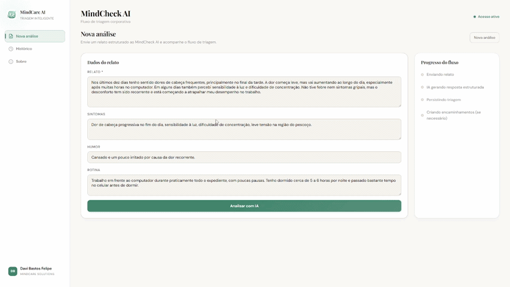

<h1 align="center">
  <br>
  MindCare AI — Frontend
  <br>
</h1>

<p align="center">
  Interface web para triagem inteligente de saúde mental corporativa, integrada a uma API de IA generativa.
</p>

<p align="center">
  
  
  
</p>

---

## Sobre o Projeto

O **MindCare AI** é uma plataforma de triagem de saúde mental voltada ao ambiente corporativo. Este repositório contém o frontend da aplicação, desenvolvido com **Angular 17** e suporte a **Server-Side Rendering (SSR)**.

A interface permite que colaboradores relatem seus sintomas, humor e rotina, submetendo essas informações a uma análise via IA generativa. O sistema classifica o risco (`BAIXO`, `MODERADO` ou `ALTO`) e gera encaminhamentos automáticos às especialidades médicas adequadas.


## Demo

<p align="center">
  <strong>Landing Page</strong>
</p>
<p align="center">
  
</p>

<p align="center">
  <strong>Fluxo da Aplicação</strong>
</p>
<p align="center">
  
</p>

---

## Tech Stack

| Tecnologia | Versão | Finalidade |
|---|---|---|
| [Angular](https://angular.io/) | 17.3 | Framework principal |
| [TypeScript](https://www.typescriptlang.org/) | 5.4 | Linguagem de desenvolvimento |
| [Angular SSR](https://angular.dev/guide/ssr) | 17.3 | Server-Side Rendering |
| [Express](https://expressjs.com/) | 4.18 | Servidor Node para SSR |
| [RxJS](https://rxjs.dev/) | 7.8 | Programação reativa e gerenciamento de estado |
| [Angular Reactive Forms](https://angular.io/guide/reactive-forms) | — | Formulários com validação |


---

## Funcionalidades

- **Autenticação JWT** — login, registro e logout com token Bearer
- **Análise de IA** — formulário de triagem que submete relato, sintomas, humor e rotina para análise via IA
- **Classificação de risco** — visualização do nível de risco (`BAIXO`, `MODERADO`, `ALTO`) e sugestões geradas pela IA
- **Encaminhamentos automáticos** — listagem de especialidades médicas recomendadas por triagem
- **Histórico paginado** — consulta de todas as triagens anteriores do usuário
- **Detalhes da análise** — visualização completa de uma triagem com seus encaminhamentos
- **Perfil do usuário** — atualização de nome e senha
- **Proteção de rotas** — guard que redireciona usuários não autenticados para `/login`
- **Notificações toast** — feedback visual de sucesso e erro em todas as ações
- **Animações de scroll** — elementos com fade-in via `IntersectionObserver`
- **Detecção de Caps Lock** — aviso em campos de senha com Caps Lock ativo

---

## Pré-requisitos

Antes de começar, certifique-se de ter instalado:

- [Node.js](https://nodejs.org/) `>= 18.x`
- [npm](https://www.npmjs.com/) `>= 9.x`
- [Angular CLI](https://angular.io/cli) `>= 17.x`

```bash
npm install -g @angular/cli@17
```

> **Importante:** a aplicação depende da [API MindCare AI](#integração-com-a-api) rodando localmente na porta `8080`. Certifique-se de que o backend está em execução antes de iniciar o frontend.

---

## Instalação

```bash
# 1. Clone o repositório
git clone https://github.com/<seu-usuario>/mindcareai-ui.git
cd mindcareai-ui

# 2. Instale as dependências
npm install
```

### Configuração da URL da API

A URL base da API é injetada via token de dependência em:

```
src/app/core/tokens/api-base-url.token.ts
```

Por padrão, aponta para `http://localhost:8080`. Altere esse valor caso a API esteja rodando em outro endereço.

---

## Como Executar

### Modo desenvolvimento (com hot reload)

```bash
npm start
```

Acesse em: [http://localhost:4200](http://localhost:4200)

### Build de produção

```bash
npm run build
```

Os artefatos serão gerados na pasta `dist/`.

### Modo SSR (Server-Side Rendering)

```bash
# 1. Gere o build com SSR
npm run build

# 2. Suba o servidor Express
npm run serve:ssr:mindcareai-ui
```

Acesse em: [http://localhost:4000](http://localhost:4000)

---

## Estrutura de Pastas

```
src/
├── app/
│   ├── core/                        # Módulo central da aplicação
│   │   ├── components/              # Componentes reutilizáveis (toast, paginação)
│   │   ├── directives/              # Diretivas (caps-lock, scroll-animate)
│   │   ├── guards/                  # Proteção de rotas (auth.guard)
│   │   ├── interceptors/            # Interceptor HTTP (injeção de Bearer token)
│   │   ├── services/                # Serviços de domínio e estado
│   │   └── tokens/                  # Tokens de injeção de dependência (API URL)
│   │
│   ├── features/                    # Módulos de funcionalidade
│   │   ├── landing/                 # Página inicial pública
│   │   ├── login/                   # Autenticação
│   │   ├── register/                # Cadastro de usuário
│   │   ├── new-analysis/            # Formulário de triagem com IA
│   │   ├── history/                 # Histórico paginado de triagens
│   │   ├── analysis-details/        # Detalhes de uma triagem e encaminhamentos
│   │   ├── profile/                 # Perfil e configurações do usuário
│   │   └── about/                   # Sobre a plataforma
│   │
│   ├── layout/
│   │   └── app-shell.component      # Shell principal (nav + router-outlet)
│   │
│   ├── models/                      # Interfaces e DTOs de domínio
│   │   ├── auth.models.ts
│   │   └── mindcheck.models.ts
│   │
│   ├── app.component.ts             # Componente raiz
│   ├── app.config.ts                # Configuração de providers (HTTP, Router, SSR)
│   ├── app.routes.ts                # Definição de rotas
│   └── app.config.server.ts         # Configuração SSR
│
├── main.ts                          # Bootstrap (browser)
├── main.server.ts                   # Bootstrap (SSR)
└── server.ts                        # Servidor Express para SSR
```

---

## Integração com a API

Este frontend consome a **API MindCare AI**, um serviço RESTful desenvolvido em **Java 17 + Spring Boot 3** com integração ao **Azure OpenAI**.

> **Repositório da API:** [github.com/thiag0renatino/mindcare-ai](https://github.com/thiag0renatino/mindcare-ai)

### Endpoints principais

| Método | Endpoint | Descrição |
|---|---|---|
| `POST` | `/auth/signin` | Autenticação e obtenção do JWT |
| `POST` | `/auth/register` | Cadastro de novo usuário |
| `POST` | `/auth/logout` | Invalidação do token |
| `GET` | `/api/usuarios/me` | Dados do usuário autenticado |
| `PATCH` | `/api/usuarios/me/nome` | Atualização de nome |
| `PATCH` | `/api/usuarios/me/senha` | Atualização de senha |
| `POST` | `/api/mindcheck-ai/analises` | Submissão de análise de IA |
| `GET` | `/api/triagens/usuario/{id}` | Histórico de triagens do usuário |
| `GET` | `/api/triagens/{id}` | Detalhes de uma triagem |
| `GET` | `/api/encaminhamentos/triagem/{id}` | Encaminhamentos de uma triagem |
| `GET` | `/api/empresas` | Listagem de empresas (registro) |

---

## Rotas da Aplicação

| Caminho | Componente | Autenticação |
|---|---|---|
| `/` | `LandingComponent` | Pública |
| `/login` | `LoginComponent` | Pública |
| `/register` | `RegisterComponent` | Pública |
| `/analysis/new` | `NewAnalysisComponent` | **Protegida** |
| `/history` | `HistoryComponent` | **Protegida** |
| `/history/:id` | `AnalysisDetailsComponent` | **Protegida** |
| `/profile` | `ProfileComponent` | **Protegida** |
| `/about` | `AboutComponent` | **Protegida** |

Rotas protegidas utilizam o `authGuard`, que redireciona para `/login` caso o usuário não esteja autenticado.

---

## Scripts Disponíveis

| Comando | Descrição |
|---|---|
| `npm start` | Sobe o servidor de desenvolvimento em `localhost:4200` |
| `npm run build` | Gera o build de produção na pasta `dist/` |
